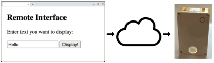
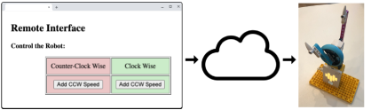
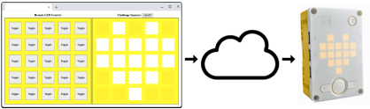
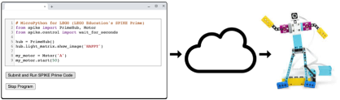
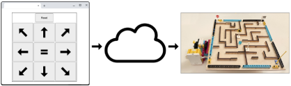
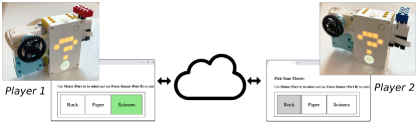

# Hello SPIKE!

A collection of experimental web-controlled SPIKE Prime projects.

## To see these projects in action, please visit:

https://edanahy.github.io/HelloSPIKE/

## List of Projects:

### Project: Display Text

**Description:** A simple demonstration of web-based remote control of the SPIKE Prime.

### Project: Motor Control Challenge

**Description:** Change the motor speed to try and stop the pointer straight up!

### Project: LED Matching Challenge

**Description:** Toggle the SPIKE Prime LEDs to try and match the pattern!

### Project: Web IDE (Integrated Development Environment)

**Description:** Create a web-based Integrated Development Environment (IDE) for SPIKE Prime.

### Project: Marble Maze

**Description:** Control the maze to navigate the marble to the finish.

### Project: Two-Player Rock-Paper-Scissors

**Description:** This project pits two remote players against each other, each using a SPIKE Prime to play Rock-Paper-Scissors

### Project: Draw My Face

**Description:** A work in progress coming soon ... stay tuned!

### Disclaimer

LEGO®, the LEGO® logo, the Brick, MINDSTORMS®, SPIKE™, and the Minifigure are trademarks of ©The LEGO® Group. All other trademarks and copyrights are the property of their respective owners. All rights reserved.

This page isn’t affiliated, authorized, or endorsed by The LEGO Group.
